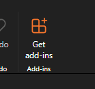
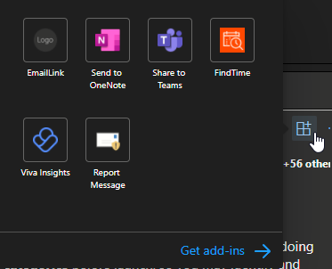
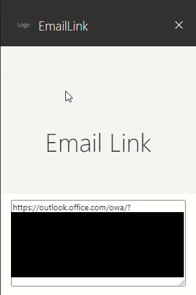

# EmailLink - Outlook Add-in

Ever want to save a link to an important email? Want to add a link from a task in another system? Now you can.

## Installation

1. Navigate to: https://outlook.office.com/mail/
2. Click the "Get add-ins" button in the ribbon

3. Click "My add-ins" in the left column
4. Scroll down to "Custom Addins"
5. Click "Add from URL..."
6. Enter `https://emaillinkaddin.z19.web.core.windows.net/manifest.prod.xml` or whatever URL you're hosting the add-in at.

## Usage

Once installed, you can use the add-in button within an email, or use the toolbar button if it exists.

A task pane will appear on the side, allowing you to copy a direct link that exact email.

